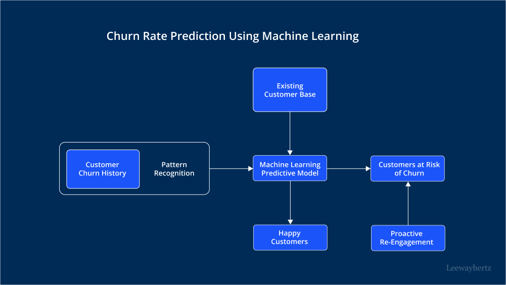
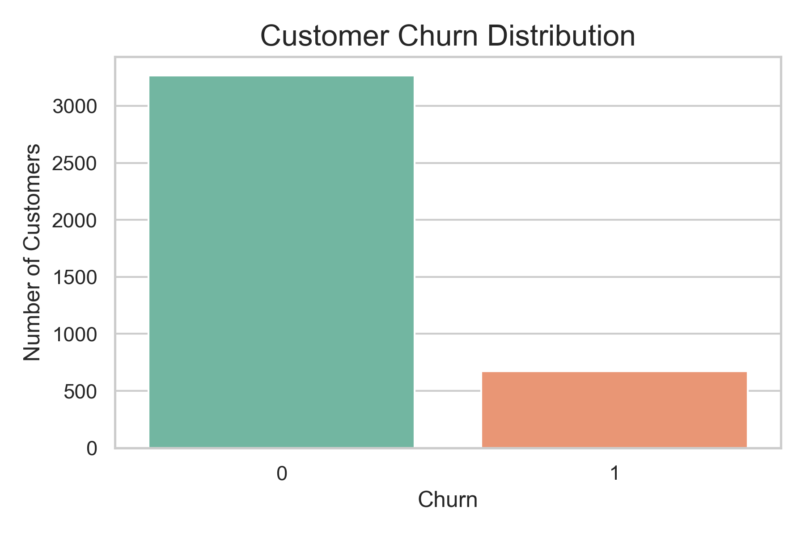
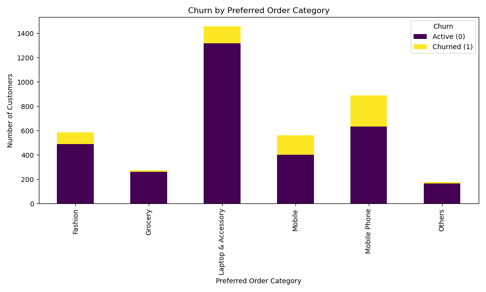

# 🧠 Customer Churn Prediction using Machine Learning

  

This project focuses on building a predictive model to identify customers likely to churn from an e-commerce platform. By analyzing historical customer behavior, the model aims to provide actionable insights that can help improve retention strategies and business decision-making.

---

## 📌 Problem Statement

Customer churn is a significant challenge in the e-commerce industry. Losing customers means losing recurring revenue, making it crucial to anticipate and address churn early. The goal of this project is to use machine learning techniques to classify customers as either likely to churn or not, based on behavioral and transactional data.

---

## 🔧 Tools & Technologies Used

- **Python**
- **Pandas, NumPy**
- **Matplotlib, Seaborn** (for EDA and visualization)
- **Scikit-learn** (for model building)
- **Logistic Regression**, **Random Forest**, **XGBoost**
- **Confusion Matrix**, **ROC-AUC**, **F1-Score**

---

## 📊 Exploratory Data Analysis (EDA)

Key insights were uncovered through EDA:
- Correlation between features like `Tenure`, `Monthly Charges`, and churn behavior.
- Distribution of churned vs non-churned customers.
- Customer segmentation based on services used.

---

## 🔍 Feature Engineering

Key steps include:
- Label encoding of categorical variables.
- Handling missing values.
- Feature scaling using StandardScaler.
- Feature importance analysis with tree-based models.

---

## 📊 Model Performance Comparison

| Model       | Accuracy | Precision (Class 1) | Recall (Class 1) | F1-Score (Class 1) |
|-------------|----------|----------------------|------------------|--------------------|
| Logistic Regression (LR) | 0.8821   | 0.74                 | 0.43             | 0.54               |
| Random Forest (RF)       | 0.9506   | 0.80                 | 0.71             | 0.74               |
| XGBoost                  | 0.9566   | 0.82                 | 0.74             | 0.77               |

---

## 📈 Evaluation Metrics

To assess the performance of the classification models, the following evaluation metrics were used:

- **Accuracy**: Measures the overall correctness of the model. However, it can be misleading in imbalanced datasets.
- **Precision (Class 1 - Churned)**: Indicates how many of the predicted churned customers were actually correct. High precision reduces false positives.
- **Recall (Class 1 - Churned)**: Measures how many actual churned customers were correctly identified. High recall ensures fewer false negatives.
- **F1-Score (Class 1 - Churned)**: The harmonic mean of precision and recall. It's a balanced metric that is especially useful when dealing with class imbalance.

These metrics were calculated for both classes, but more focus was given to **Class 1 (Churned customers)** since the goal is to accurately identify customers likely to leave.

---

## 🧠 Business Insight from XGBoost Evaluation Metrics

The XGBoost model achieved an **accuracy of 95.06%**, but accuracy alone isn’t enough in a churn prediction scenario. What really matters is how well the model identifies **churned customers (Class 1)** — these are the people who are likely to stop using the service.

Here’s what each metric means in business terms:

- **Precision (Class 1 - Churned: 81%)**
  > This means that when the model predicts a customer will churn, it's correct **81% of the time**.  
  ✅ **Business Impact**: Fewer false alarms. You don’t waste resources offering retention deals to customers who wouldn’t have left anyway.

- **Recall (Class 1 - Churned: 71%)**
  > The model correctly identifies **71% of all actual churners**.  
  ✅ **Business Impact**: You can proactively target most of the customers at risk before they leave, reducing revenue loss.

- **F1-Score (Class 1 - Churned: 74%)**
  > A balanced score combining precision and recall.  
  ✅ **Business Impact**: Confirms that the model performs well overall in catching churners without flooding the system with false positives.

---

🧩 **Why This Matters**  
In subscription-based or e-commerce businesses, even small improvements in churn reduction can significantly impact profits.  
By using a model with high **recall**, the company ensures it doesn't miss most at-risk customers.  
By maintaining high **precision**, the business avoids wasting effort on the wrong segment.

💡 This kind of data-driven targeting leads to **smarter retention campaigns**, better **customer experience**, and higher **lifetime value** per customer.

## 🌍 Business Value for E-commerce Companies in Africa & Beyond

This churn prediction model is designed to empower **e-commerce businesses**, especially in emerging markets like **Zimbabwe and the broader African region**, where **customer acquisition costs are high**, and **customer retention is key to sustainable growth**.

### 🎯 What Can Businesses Gain from This Model?

- 🔍 **Identify At-Risk Customers Before They Leave**  
  With a **recall of 71%** for churned customers, businesses can detect most customers likely to churn and take action **before** losing them — crucial in markets with limited customer pools.

- 💰 **Run Cost-Efficient Retention Campaigns**  
  Thanks to a **precision of 81%**, the model avoids unnecessary spending by ensuring that offers and incentives are only given to customers **who are truly at risk**.

- 📊 **Smarter Resource Allocation**  
  Insights from model features (e.g., satisfaction score, complaints, preferred order category) allow teams to **target marketing efforts strategically**, focusing on the segments with the highest impact.

- 💼 **Customer-Centric Decisions**  
  Companies can prioritize service improvements based on real data — for example, if churn is higher among customers using a particular delivery method or product category.

- 📈 **Boost Customer Lifetime Value (CLV)**  
  Retaining a customer in Zimbabwe or Africa often means building long-term brand loyalty. Reducing churn directly increases **CLV**, which translates to more stable revenue.

---

### 🧠 Why This Matters in Africa’s E-commerce Space

Many African startups face stiff competition and tight budgets. This project shows how **machine learning can bring enterprise-level insights to local businesses**, helping them scale sustainably by:

- Focusing on **retention instead of constant acquisition**
- Building **data-driven strategies** instead of guesswork
- Becoming more **customer-centric and agile**

> 💡 If deployed well, this solution can become a competitive advantage for any e-commerce business aiming to grow and retain a loyal customer base in Africa and similar markets.

---

## 🙋‍♂️ About Me

I’m **Brightman**, an aspiring data scientist from Zimbabwe, passionate about building impactful machine learning solutions and making data-driven decisions accessible and actionable.

---

## 📫 Contact

- **LinkedIn**: [linkedin.com/in/brightmanmutumwapavi](www.linkedin.com/in/brightman-mutumwapavi-aa567b28a)
- **Portfolio**: [brightman.dev](https://myportfolio.com)
- **Email**: mutumwapavibrightma@gmail.com
