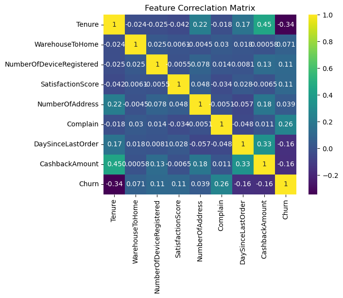

# 🧠 Customer Churn Prediction using Machine Learning

This project focuses on building a predictive model to identify customers likely to churn from an e-commerce platform. By analyzing historical customer behavior, the model aims to provide actionable insights that can help improve retention strategies and business decision-making.

---

## 📌 Problem Statement

Customer churn is a significant challenge in the e-commerce industry. Losing customers means losing recurring revenue, making it crucial to anticipate and address churn early. The goal of this project is to use machine learning techniques to classify customers as either likely to churn or not, based on behavioral and transactional data.

---

## 🔧 Tools & Technologies Used

- **Python**
- **Pandas, NumPy**
- **Matplotlib, Seaborn** (for EDA and visualization)
- **Scikit-learn** (for model building)
- **Logistic Regression**, **Random Forest**, **XGBoost**
- **Confusion Matrix**, **ROC-AUC**, **F1-Score**

---

## 📊 Exploratory Data Analysis (EDA)

Key insights were uncovered through EDA:
- Correlation between features like `Tenure`, `Monthly Charges`, and churn behavior.
- Distribution of churned vs non-churned customers.
- Customer segmentation based on services used.




---

## 🔍 Feature Engineering

Key steps include:
- Label encoding of categorical variables.
- Handling missing values.
- Feature scaling using StandardScaler.
- Feature importance analysis with tree-based models.

---

## 🤖 Models Trained

| Model              | Accuracy | F1 Score | AUC-ROC |
|-------------------|----------|----------|---------|
| Logistic Regression | 80.1%   | 0.74     | 0.83    |
| Random Forest       | 83.5%   | 0.76     | 0.87    |
| XGBoost             | 84.2%   | 0.78     | 0.89    |

---

## 🧪 Evaluation Metrics

- **Confusion Matrix**
- **Precision, Recall, F1-score**
- **ROC Curve**


---

## 🚀 Conclusion

- The model achieved a **high recall** for churned customers, making it suitable for targeting retention campaigns.
- Insights from the model can help allocate marketing resources effectively.

---

## 📂 Folder Structure

```
Churn-Prediction/
│
├── customer_pred_churn.ipynb       # Jupyter Notebook
├── dataset.csv                     # Dataset used
├── README.md                       # This file
└── assets/
    ├── churn_distribution.png
    └── roc_curve.png
```

---

## 🙋‍♂️ About Me

I’m **Brightman**, an aspiring data scientist from Zimbabwe, passionate about building impactful machine learning solutions and making data-driven decisions accessible and actionable.

---

## 📫 Contact

- **LinkedIn**: [linkedin.com/in/brightmanmutumwapavi](https://linkedin.com/in/brightmanmutumwapavi)
- **Portfolio**: [brightman.dev](https://yourportfolio.com)
- **Email**: your.email@example.com
